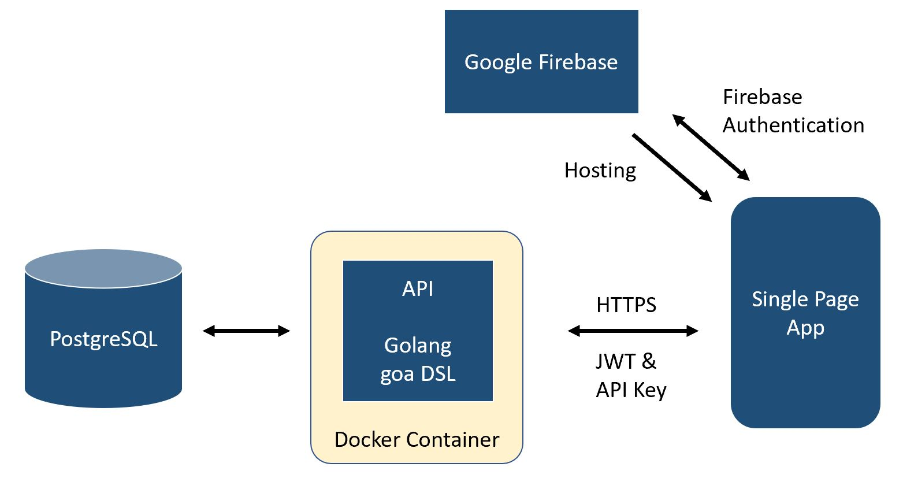

# My App

Repository for a SPA web app

## Desired Architecture Overview

## Instructions to start dev environemnt
docker-compose -f docker-compose.yml up 
goa gen src/go/design

## Tasks

- [ ] (if required) change folder structure   
- [ ] Set up a PostgreSQL database init script with a **Thing** table
- [ ] Set up a Dockerfile to bring up a PostgreSQL DB for dev/testing
- [ ] Set up a [goa design](https://github.com/goadesign/goa) for a API to manage **Things**
  - [ ] CRUD a **Thing**
- [ ] Set up a multistage Dockerfile to build and start golang API service 
- [ ] Set up a docker-compose to build and bring up a dev environment with API creating **Things** in DB
- [ ] Update README with instructions to start dev environment 

